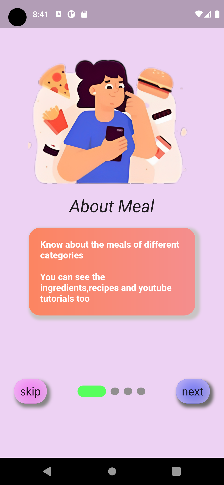
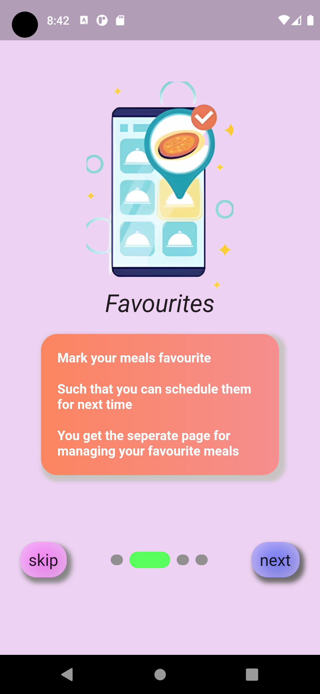
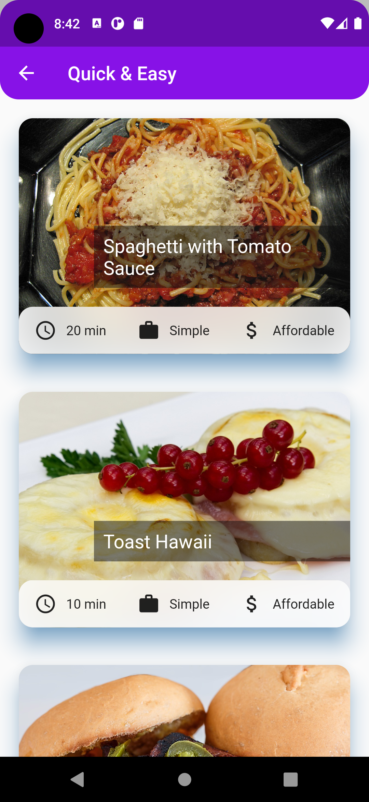
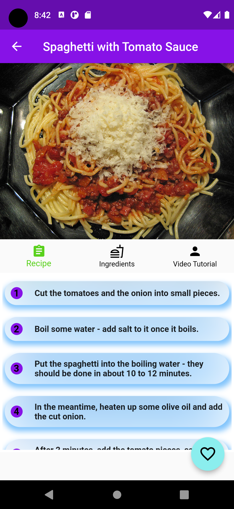
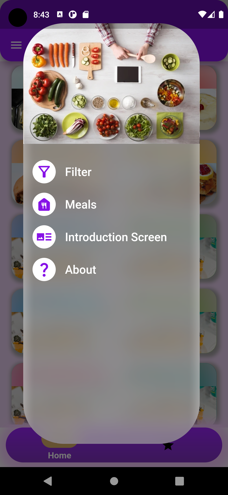
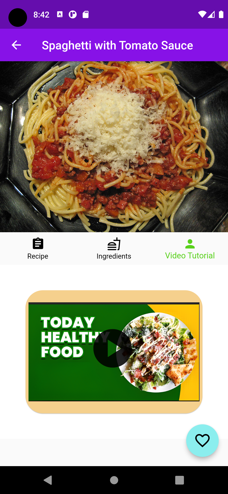

# MealOpedia

A new Flutter project.
An app for helping the user to get the detailed informations about the meal.
It provides features like video tutorials for cooking the meal ,different categories of meals,recipe and ingredients section too.

User can mark their favourite meal and check the marked meal after in the Favourites section.
Filter page is also their to filter the meal as per the user's requirements.

## Project Snapshots

Here are some snapshots of my project:

  
  
  

  
  
  

  

## Getting Started

This project is a starting point for a Flutter application.

A few resources to get you started if this is your first Flutter project:

- [Lab: Write your first Flutter app](https://docs.flutter.dev/get-started/codelab)
- [Cookbook: Useful Flutter samples](https://docs.flutter.dev/cookbook)

For help getting started with Flutter development, view the
[online documentation](https://docs.flutter.dev/), which offers tutorials,
samples, guidance on mobile development, and a full API reference.
